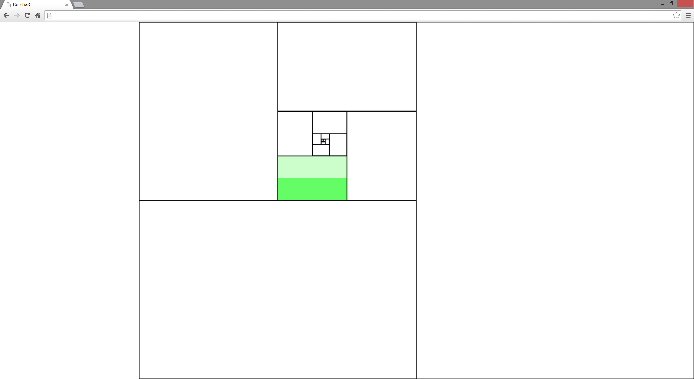

new_ko-cha_variable_layout_demo
==========================
こんな風にエディタのレイアウト変えれたら良いな的なデモ。

左クリックで区切り追加、右クリックで解除。

[http://setchi.jp/labo/new_ko-cha_variable_layout_demo/](http://setchi.jp/labo/new_ko-cha_variable_layout_demo/)

